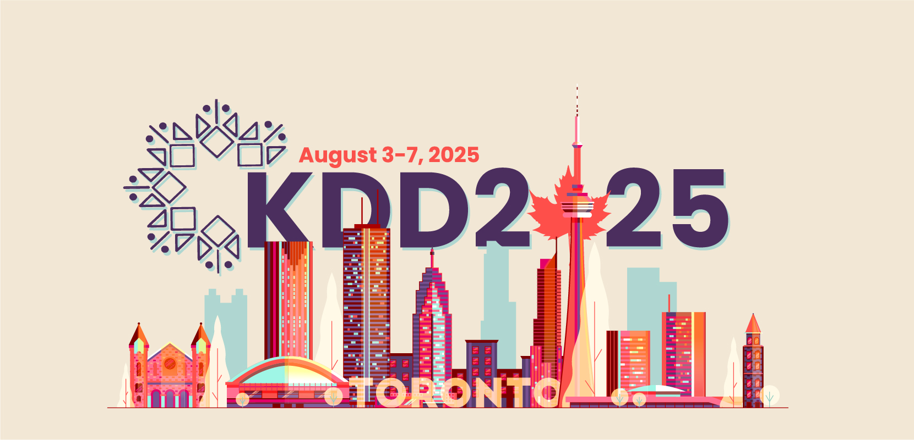

  

### Overview

As LLMs such as GPT-4 continue to redefine boundaries in both complexity and capability, their integration into the scientific and societal domains is not just beneficial but essential. In particular, Large Language Models (LLMs) have demonstrated substantial value in improving our understanding of complex datasets and generating insights across various fields such as healthcare, environmental science, education, and public policy. By bringing together experts and enthusiasts from diverse fields, the workshop aims to foster a comprehensive understanding of how LLMs can redefine traditional research methodologies. Participants will explore innovative ways to harness the power of LLMs for greater efficiency and innovation in their respective fields, potentially catalyzing a new era of scientific and societal advancement. Therefore, we propose the SciSoc LLM Workshop at KDD'25: "Large Language Models for Scientific and Societal Advances" aims to explore the profound implications and potential of LLMs in driving forward scientific inquiry and addressing critical societal challenges. 

### OBJECTIVES

LLMs for scientific and societal advances (SciSoc LLM) represent an evolving concept that shifts the focus from simple questionanswer tasks to broader and more impactful applications in science and society. LLMs have demonstrated capabilities such as solving university-level math problems by generating solution code, supporting language translation, and answering questions on bar exams with high accuracy, all without additional training. Given the expanded scope and increasing power of LLMs, their potential to significantly impact scientific discovery and societal progress is becoming increasingly evident. LLMs have opened up vast opportunities for scaling and accelerating advancements across scientific and social domains. For example, MetaAI introduced the first science-specific LLM designed to support scientific discovery in research, while LLMs have also enabled large-scale computational social science research. These advancements have found LLMs’ potential for scientific and societal advances. 

The objective of this workshop is to explore recent advances in both the theoretical foundations and practical applications on science and society of LLMs. We propose the SciSoc LLM Workshop at KDD’25 to serve as a platform where academic researchers and industry professionals can present and discuss cutting-edge research, real-world implementations, and new applications of SciSoc LLMs. This timing aligns perfectly with the current momentum in LLM research and application, making it an essential event for stakeholders aiming to shape the future of scientific and societal advancements. Moreover, the interdisciplinary nature of KDD encourages a broad spectrum of ideas and solutions, which creates an optimal environment for investigating the extensive applications of LLMs. This workshop will also serve as a nice complement to the potential LLM Day at KDD’25, providing a specialized focus on scientific and societal advances and fostering interactions among participants.

### TOPICS

We enthusiastically invite submissions from diverse fields at the nexus of AI, science, and society, including but not limited to healthcare, environmental science, education, public policy, social science, chemistry, and biology. We particularly encourage contributions that demonstrate the practical applications of LLMs in addressing real-world challenges. Relevant topics, focused on scientific and societal applications, **include but are not limited to** the following list:

- Pre-training scientific foundation models
- Development of multimodal language models that integrate modalities like images, graphs, and time series
- Utilization of retrieval-augmented generation techniques
- Design of scientific multi-agent systems
- Creation of datasets and benchmarks for LLM evaluation in scientific and societal context
- Scalable fine-tuning techniques of LLMs in practical applications
- Active learning strategies with LLMs in practical applications
- Enhancing code generation for scientific practitioners

### Submission Details

We welcome submissions of papers ...

### Important Dates

The important dates of the workshop should not be later than:

- Workshop paper submission: ...

All submission deadlines are end-of-day in the **[Anywhere on Earth (AoE)](https://time.is/Anywhere_on_Earth)** time zone.
